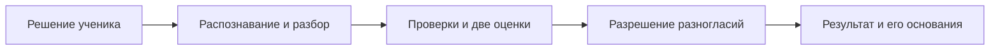

# PredelAI — кейс системного аналитика

**Командный проект: сервис проверки развёрнутых решений по математике ЕГЭ. Моя роль — бизнес- и системный анализ.**

Этот репозиторий показывает мой вклад в проект и аналитические материалы: от проблемы и требований до API, модели данных и проверки результатов на SQL. Документы можно читать прямо на GitHub, без установки приложения.

## Мой вклад

В PredelAI я участвовал в анализе проблемы, декомпозиции проверки на этапы, описании критериев и контрактов, проработке логики оценщиков и арбитра, подготовке промптов и разборе результатов тестирования. Программный код создавали другие участники команды.

Для этого кейса я систематизировал требования и проектные решения, оформил сценарии, диаграммы, спецификации API и анализ данных. [Подробнее о моей роли и связи материалов с проектом](docs/22_project_contribution.md).

## Какую задачу решали

ИИ мог указывать на несуществующие ошибки ученика. Когда проверка выполняется одним запросом, по итоговому баллу трудно понять, где возникла ошибка: при распознавании записи, разборе решения или применении критериев.

В проекте проверка разделена на этапы. Два оценщика анализируют решение независимо, арбитр разбирает определённые правилами разногласия, а промежуточные результаты сохраняются для анализа. Реализованы сайт, синхронный API и специализированная проверка заданий №13–15.

В документах отдельно обозначены действующая реализация и целевые улучшения: обработка технических ошибок, API v2, ручная проверка и интеграция с LMS. [Границы](docs/02_scope.md) · [Состояние реализации](docs/20_implementation_status.md).

## Навыки и примеры работ

| Навык | Что можно оценить в кейсе | Артефакт |
|---|---|---|
| Анализ требований | Связь бизнес-проблемы с функциональными требованиями, ограничениями и критериями приёмки | [Требования](docs/09_functional_requirements.md), [трассировка](docs/14_traceability_matrix.md) |
| Описание сценариев | Основной ход, альтернативы, ошибки, предусловия и результат для пользователя | [UC-01: отправка решения](docs/03_use_case_text_submission.md) |
| Моделирование процессов и взаимодействий | BPMN, UML Sequence и состояния; границы ответственности компонентов | [Процесс проверки](processes/README.md), [диаграмма взаимодействия](diagrams/pipeline_sequence.md) |
| Проектирование REST API | Запросы и ответы, ошибки, валидация, текущий и целевой контракты | [Спецификация API](docs/11_api_specification.md), [OpenAPI](contracts/openapi-target-v2.yaml) |
| Моделирование данных | Сущности, ключи, связи, словарь и разделение текущей и целевой моделей | [ERD](diagrams/erd.md), [словарь данных](docs/17_glossary_and_data_dictionary.md) |
| SQL и анализ качества | JOIN, агрегаты, оконные функции, пропуски, выбор эталона и сопоставимые знаменатели | [Запросы](sql/README.md), [сравнение продуктов](docs/21_product_comparison.md) |
| Проверка решения | Критерии приёмки и проверяемые примеры API в Postman | [Критерии](docs/08_acceptance_criteria.md), [протокол API](docs/12_api_verification_protocol.md) |

Для первого знакомства достаточно открыть **[мой вклад](docs/22_project_contribution.md)** и **[UC-01](docs/03_use_case_text_submission.md)**. Для технического просмотра — пройти от сценария к API и критериям приёмки либо посмотреть SQL-сравнение.

## Работа с реальными данными

Команда использовала датасет на 165 работ для разработки и оценки продукта. Эталонные баллы `true_score` выставляли сами: исходная оценка куратора тоже могла быть неверной. Для прямого сравнения отобрана **91 работа с оценками обеих систем и эталоном**.

| Продукт | Совпадения с эталоном | Доля совпадений | MAE, баллы |
|---|---:|---:|---:|
| PredelAI | 83 из 91 | 91,21% | 0,110 |
| Стобалльный репетитор | 84 из 91 | 92,31% | 0,110 |

Это результаты выборки, использованной при разработке. Версии запусков неизвестны; общее преимущество продукта по этим числам не заявляется. [Состав выборки, методика и SQL](docs/21_product_comparison.md).

Отдельно проанализированы 9 042 работы с оценками сторонней модели и куратора: качество данных, совпадения баллов, завышения и занижения. Два набора имеют разные эталоны и не объединяются в один показатель. [Анализ первого набора](docs/15_dataset_analysis.md).

## Что проверено

Для аналитического кейса подготовлен изолированный API-стенд: **38 запросов и 74 проверки Postman пройдены**. Хранилище и оценивание заменены синтетическими данными; протокол подтверждает поведение обработчиков в этих условиях. Целевой API v2 описан спецификацией.

**11 SQL-запросов** выполнены на двух реальных снимках данных; **28 синтетических сценариев** проверяют расчёты, пропуски и ключи. В репозитории сохранены методика, агрегаты и протоколы. Исходные ученические работы и фотографии не публикуются.

Полная карта материалов

| Раздел | Содержание |
|---|---|
| Постановка | [Проблема](docs/01_problem_statement.md), [границы](docs/02_scope.md), [участники и риски](docs/19_assumptions_constraints_risks.md) |
| Требования | [User Stories](docs/07_user_stories.md), [Use Case](docs/03_use_case_text_submission.md), [функциональные](docs/09_functional_requirements.md) и [нефункциональные требования](docs/10_non_functional_requirements.md), [приёмка](docs/08_acceptance_criteria.md) |
| Проектирование | [Архитектура](docs/04_pipeline_architecture.md), [этапы проверки](docs/05_layer_specifications.md), [JSON-контракты](docs/06_json_contracts.md), [бизнес-правила](docs/18_business_rules_and_decision_tables.md) |
| Диаграммы | [Контекст](diagrams/system_context.md), [Sequence](diagrams/pipeline_sequence.md), [состояния](diagrams/state_diagram.md), [ERD](diagrams/erd.md), [арбитр](diagrams/arbiter_decision_flow.md), [BPMN](processes/README.md) |
| API | [Спецификация](docs/11_api_specification.md), [текущий OpenAPI](contracts/openapi-current.yaml), [целевой OpenAPI](contracts/openapi-target-v2.yaml), [текущая](postman/uc01-current.postman_collection.json) и [целевая коллекции Postman](postman/uc01-target-v2.postman_collection.json) |
| Анализ данных | [Метрики](docs/13_metrics.md), [первый набор](docs/15_dataset_analysis.md), [сравнение продуктов](docs/21_product_comparison.md), [SQL](sql/README.md), [модель для JOIN](sql/comparison/README.md) |
| Проверка и развитие | [Трассировка](docs/14_traceability_matrix.md), [статус реализации](docs/20_implementation_status.md), [направления развития](docs/16_product_roadmap.md) |
| Воспроизводимость | [Инструменты и команды](tools/README.md), [API-протокол](verification/uc01-api-report.json), [SQL-протокол](verification/sql-report.json), [первый анализ](verification/dataset-analysis-report.json), [сравнение](verification/comparison-analysis-report.json), [снимок проверки исходников](contracts/source-snapshot.json) |

