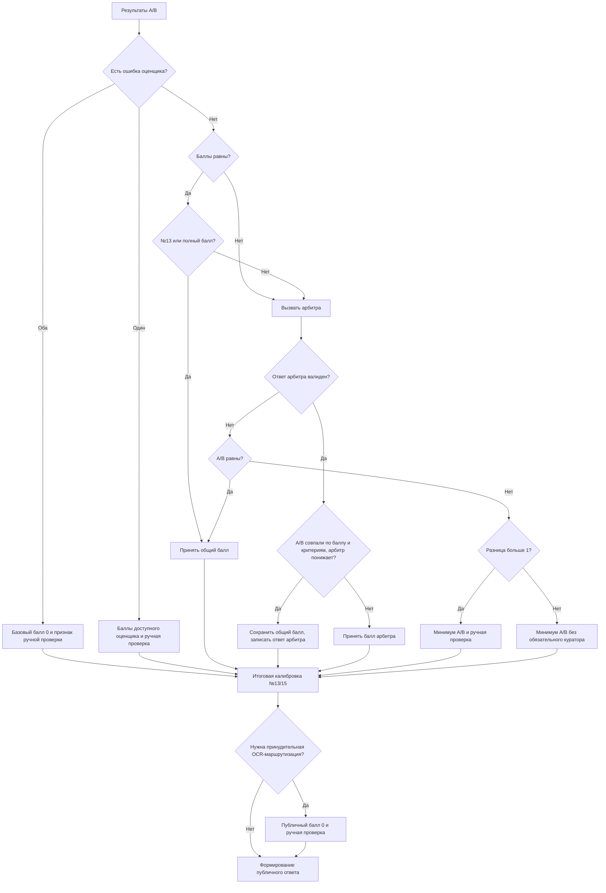

# Решение по оценкам A/B и арбитра

## Реализованный алгоритм

Сравниваются баллы после внутренней валидации, пересчёта и калибровки оценщиков.

Калибровка может изменить балл и необходимость ручной проверки. Влияние этой операции нельзя скрывать за названием «согласие моделей». Источник правил — BR-005 и [матрица реализации](../docs/20_implementation_status.md).

## Целевая политика

При неразрешённом конфликте итог не утверждается автоматически: сохраняется предварительная оценка и создаётся ручная проверка. При отсутствии оценки возвращается `null` и технический статус. Изменение маршрута из-за OCR не подменяет отсутствие оценки математическим нулём. Полная целевая таблица находится в [бизнес-правилах](../docs/18_business_rules_and_decision_tables.md), здесь она не дублируется.
