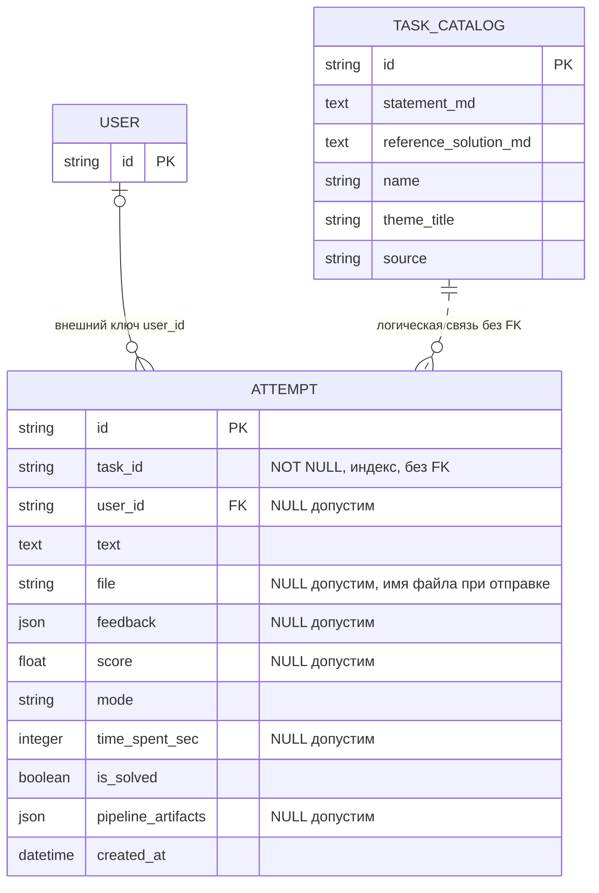
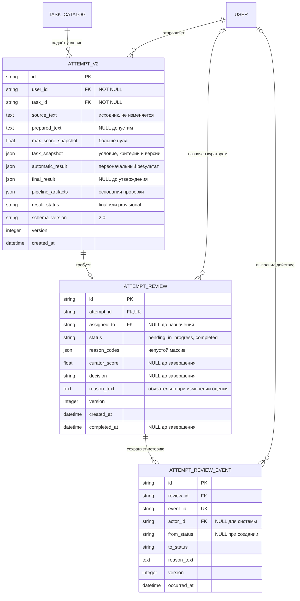
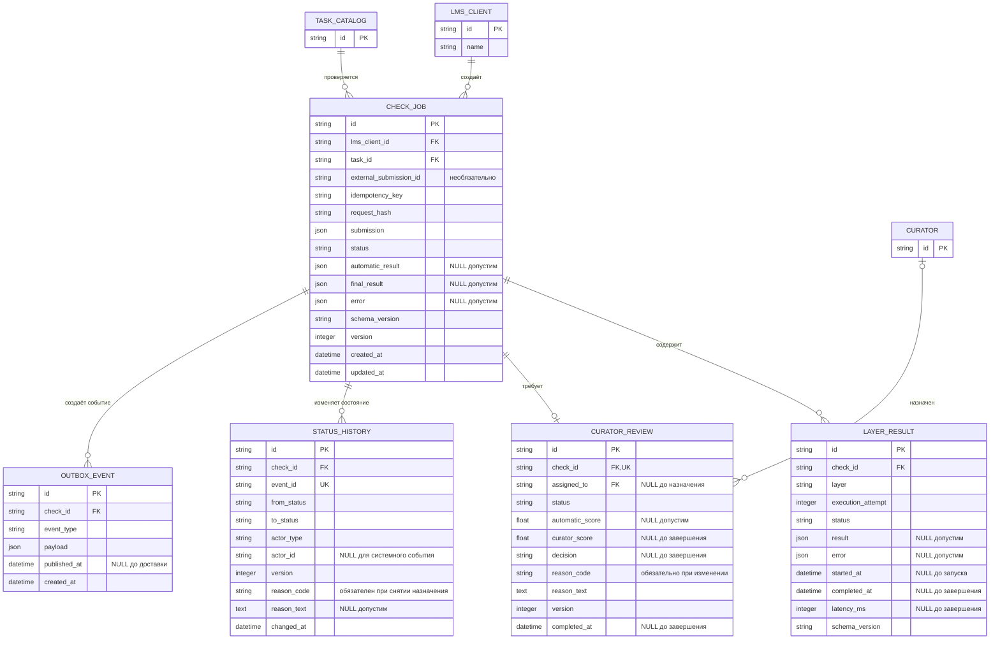

# Модель данных

## Реализация: фрагмент физической модели

Пунктирная связь с каталогом описывает ожидаемую предметную принадлежность, а не гарантированную ссылочную целостность БД. `user_id` допускает NULL; обязательная аутентификация текущего API не делает физическую колонку NOT NULL. `String` не обеспечивает проверку формата UUID.

`solution_text` публичного API соответствует `Attempt.text`. Пути исходных файлов находятся в `pipeline_artifacts.uploads[].storage_path`. В `Attempt.file` текущий обработчик отправки сохраняет имя или объединённые имена. `updated_at` отсутствует, `max_score` хранится внутри `feedback`. [Словарь и сопоставление полей](../docs/17_glossary_and_data_dictionary.md).

## Целевая логическая модель сайта: API 2.0

Эта модель обеспечивает C-11 и расширение А7 в [UC-01](../docs/03_use_case_text_submission.md). Она проектируется отдельно от действующей таблицы `Attempt` и интеграционных заданий LMS. Названия сущностей логические; миграции БД и SQL на этом этапе не создаются.

### Ограничения и отображение в API

- У каждой попытки есть владелец и задача. Автор запроса определяется токеном; доступ к истории фильтруется по владельцу на сервере.
- `source_text` содержит исходный текст до преобразований; `prepared_text` — отдельное представление для обработки. Снимок условия, критериев, их версий и максимума сохраняет основания оценки после изменения каталога.
- `automatic_result` сохраняет первоначальные пояснения, источник, причины и балл, в том числе `null`, если числовой оценки нет. Ручная проверка его не перезаписывает. Для автоматического окончательного решения `final_result` совпадает с принятым автоматическим результатом; после куратора содержит утверждённый результат.
- `UNIQUE(attempt_id)` допускает не более одной задачи куратора на попытку в первой версии. Предварительная попытка, задача со статусом `pending` и событие её создания сохраняются одной транзакцией до HTTP 200. Автоматическая окончательная попытка задачи куратора не требует.
- При назначении заполняется `assigned_to`, статус становится `in_progress`; назначать можно только уполномоченного пользователя. При снятии назначения статус возвращается в `pending`, назначение очищается, причина записывается в историю.
- При завершении обязательны автор, время, числовой балл в пределах снимка максимума и решение `confirmed` либо `overridden`. Для изменения балла или пояснений обязательна причина. Если автоматического балла не было, решение считается `overridden` с причиной отсутствия автоматической оценки.
- Завершение ручной проверки атомарно сохраняет `final_result`, переводит попытку в `final`, задачу в `completed` и добавляет событие. Ожидаемая `version` защищает от перезаписи конкурентным действием; повтор `event_id` не создаёт второй переход. Завершённую задачу не открывают повторно в этой версии.
- Состояние и история ручной проверки изменяются вместе. Автоматическое каскадное удаление аудита не предполагается; сроки хранения согласуются отдельно.

| Публичное поле C-11 | Источник в целевой модели |
|---|---|
| `id`, `task_id`, `created_at` | `AttemptV2.id`, `task_id`, `created_at` |
| `solution_text` | `AttemptV2.source_text` |
| `max_score` | `AttemptV2.max_score_snapshot` |
| `result_status` | `AttemptV2.result_status` |
| `score`, `feedback`, `decision` | `final_result` при `final`, иначе `automatic_result` |
| `is_solved` | Вычисляется: `final` и балл равен максимуму; отдельно в логической модели не хранится |
| `review.id`, `review.status` | Связанная `AttemptReview`; `null`, если автоматический результат окончательный |

Гарантия существования `review.id` требует реализации этой связи и транзакции. Проверенная форма JSON не доказывает сохранение записи. [Описание API](../docs/11_api_specification.md), [протокол и границы проверки](../docs/12_api_verification_protocol.md).

## Целевая логическая модель LMS и ручной проверки

## Ограничения целевой модели

- `UNIQUE(lms_client_id, idempotency_key)` защищает создание проверки; `request_hash` выявляет повтор ключа с другим телом.
- `UNIQUE(check_id, layer, execution_attempt)` различает исполнения этапа и блокирует дубли одного исполнения.
- `CuratorReview.check_id` уникален: в первой версии не более одной ручной проверки на задание.
- `assigned_to` связывается с уполномоченным куратором. При снятии назначения запись возвращается в `pending`.
- `decision` принимает `confirmed` или `overridden`; при завершении обязательны оценка, автор и время. При отсутствии автоматической оценки новое ручное решение считается `overridden` с причиной `NO_AUTOMATIC_SCORE`.
- Баллы находятся в диапазоне задачи; `null` означает отсутствие оценки, а не ноль. Межтабличные проверки диапазона выполняет приложение либо согласованный механизм БД.
- `version` обеспечивает проверку конкурентных изменений; история хранит новую версию каждого перехода. `event_id` обеспечивает дедупликацию переходов. При снятии назначения куратору обязательна причина в истории.
- Автоматический и окончательный результаты хранятся раздельно. При автоматическом принятии окончательный результат соответствует автоматическому; после куратора — ручному.
- Задание и исходящее событие сохраняются одной транзакцией. Подтверждение доставки не удаляет историю обработки.
- Пока проверка активна, связанные записи и исходная работа не удаляются. Сроки хранения завершённых проверок и порядок удаления согласуются отдельно; автоматическое каскадное удаление аудита не предполагается.

Эта схема описывает проектируемые сущности и ограничения; она не является существующей схемой SQLite.
