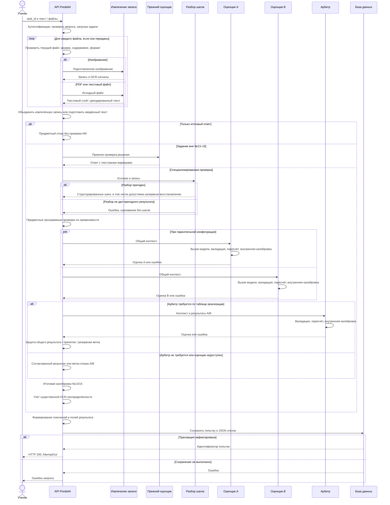
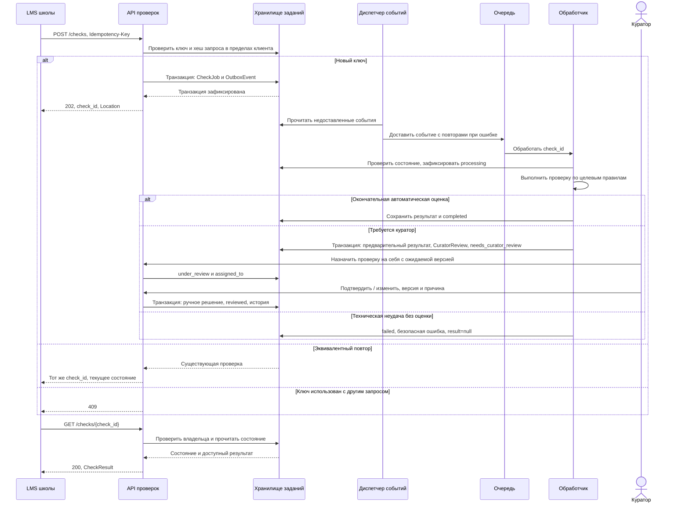
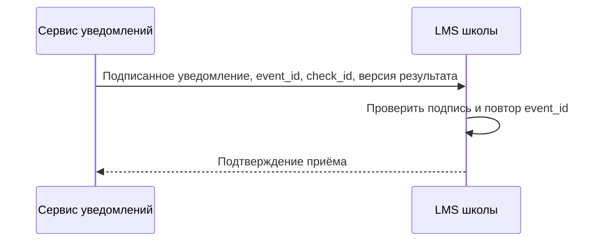

# Диаграммы взаимодействия

## Реализация: синхронная отправка

Целевые условия текстового сценария, пользовательские действия и обработка потери ответа описаны в [UC-01](../docs/03_use_case_text_submission.md). Диаграмма ниже сохраняет пометку реализации; наличие связи с UC не означает выполнения всех его требований.

Извлечение пустого текста или неверный запрос останавливают последовательность до оценивания; HTTP-коды приведены в C-01. Ветка технической ошибки внутри оценивания может сформировать сохраняемый результат текущего API; целевые требования к отсутствующей оценке описаны отдельно. Обновление статистики пользователя опущено как второстепенное для кейса действие после сохранения попытки.

## Целевая интеграция: надёжный приём и polling

При неуспешном сохранении API не подтверждает приём. Временная недоступность очереди после фиксации транзакции не теряет запрос: событие остаётся в хранилище. Повторная доставка не создаёт второй итоговый результат; переходы проверяют версию и текущее состояние.

## Дополнительный webhook — отдельный вариант

Webhook не входит в первую целевую версию. Перед включением согласуются алгоритм подписи, ответ подтверждения, число повторов, интервалы и срок доставки. Polling остаётся способом получения текущего результата; GET всегда инициирует LMS.
