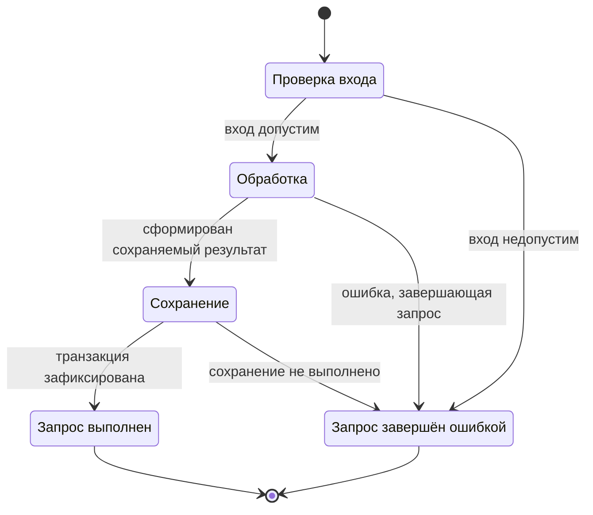
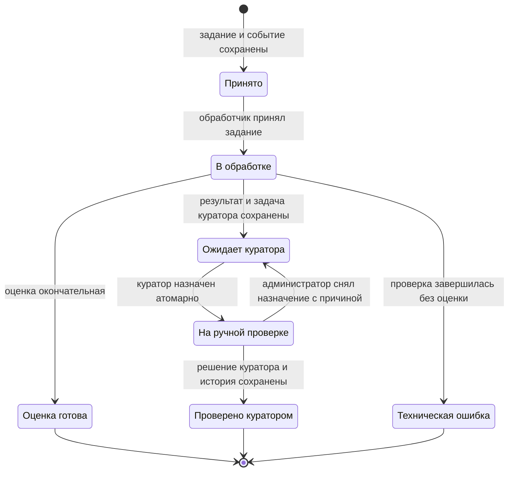

# Модель состояний

## Реализация: обработка синхронного запроса

«Запрос выполнен» не означает, что математическая оценка окончательна: текущий ответ может требовать куратора. Отдельной сущности асинхронного задания здесь нет. Статусы записей этапов: `ok`, `error`, `skipped`; решения публичной маршрутизации: `AUTO_ACCEPT`, `MANUAL_REVIEW_REQUIRED`, а также `null`, если поле не заполнено.

## Целевой результат сайта: C-11

Статус результата `AttemptV2` и состояние связанной `AttemptReview` описывают разные сущности. Они не являются состояниями HTTP-соединения. Связи показаны в [ERD](erd.md), поля ответа — в [API 2.0](../docs/11_api_specification.md).

| Событие | Результат попытки | Ручная проверка | Условие |
|---|---|---|---|
| Автоматическая оценка окончательная | `final` | Отсутствует | Итог зафиксирован; `review=null` |
| Нужен ручной разбор | `provisional` | `pending` | Попытка, задача и событие создания зафиксированы вместе |
| Куратор назначен | `provisional` | `in_progress` | Назначение уполномоченному пользователю и история сохранены |
| Назначение снято | `provisional` | `pending` | Назначение очищено, причина снятия сохранена |
| Куратор завершил разбор | `final` | `completed` | Утверждённый результат, автор, время и история сохранены одной транзакцией |

При техническом отказе без результата API возвращает объект ошибки с `result=null`; состояние `failed` не добавляется к `result_status`. При неизвестном исходе фиксации наличие попытки не утверждается и не отрицается. Завершённый HTTP 200 не означает завершённую ручную проверку. Повторное открытие окончательного результата в эту версию не входит.

## Целевая модель CheckJob

## Условия переходов

| Переход | Обязательные условия и данные |
|---|---|
| Создание → `received` | Валидный запрос, клиент, ключ, хеш запроса, исходный текст и сохранённое событие обработки |
| `received` → `processing` | Совпадение ожидаемой версии; один обработчик получает право исполнения |
| `processing` → `completed` | Итоговый числовой балл, `result_status=final`, ручная проверка не требуется |
| `processing` → `needs_curator_review` | Предварительный результат, причина и одна связанная задача куратора |
| `processing` → `failed` | Безопасный объект ошибки; итоговая оценка отсутствует |
| `needs_curator_review` → `under_review` | Уполномоченный куратор, назначение и новая версия записи |
| `under_review` → `needs_curator_review` | Действие администратора, снятие назначения и причина; история сохраняется |
| `under_review` → `reviewed` | Числовая оценка куратора, автор, время, причина при изменении, сохранённый автоматический результат |

Терминальные состояния: `completed`, `reviewed`, `failed`. Иные переходы запрещены и возвращают 409. Авторизационные ограничения проверяются до изменения состояния. Каждый переход хранит событие, время, автора и версию; повтор `event_id` не создаёт второй переход.

Повторная доставка технического задания и состояние проверки — разные понятия. Неуспешную доставку повторяют без создания нового CheckJob. Восстановление обработки после сбоя исполнителя должно сохранять один результат и историю исполнений. Политика числа повторов и контроля зависших обработчиков требует согласования перед реализацией; это не дополнительный публичный статус.

При `failed` новая пользовательская попытка создаётся с новым ключом. Отмена и повторное открытие терминального задания не входят в первую версию.

Статусы задачи куратора: `pending`, `in_progress`, `completed`; они соответствуют ожиданию, назначению и завершению ручной проверки. Предварительный результат доступен LMS с явной маркировкой; интерфейс ученика не показывает его как окончательный.
