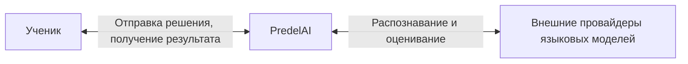
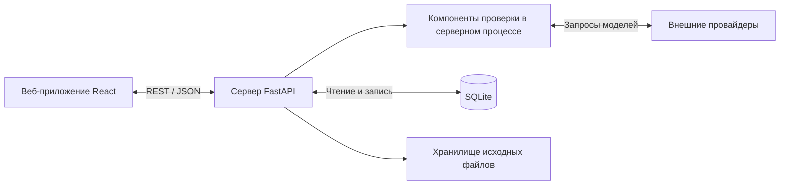
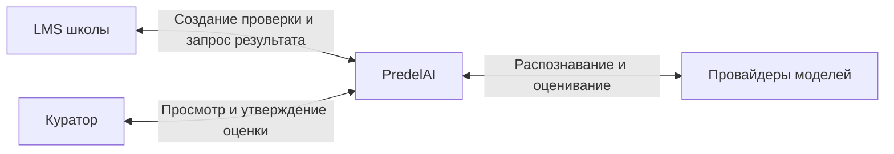

# Контекст системы

## Реализация: внешняя граница

Сайт, API, компоненты проверки и БД входят в PredelAI. Провайдер моделей — внешняя зависимость. LMS и рабочее место куратора в действующую границу не включены.

## Реализация: внутреннее устройство

Компоненты проверки не изображаются отдельными микросервисами: это логическая декомпозиция внутри приложения.

## Целевая интеграция

Клиент LMS аутентифицируется отдельно; куратор имеет ролевой доступ. Детали очереди, хранения и повторной доставки раскрыты в архитектуре и диаграмме взаимодействия.
