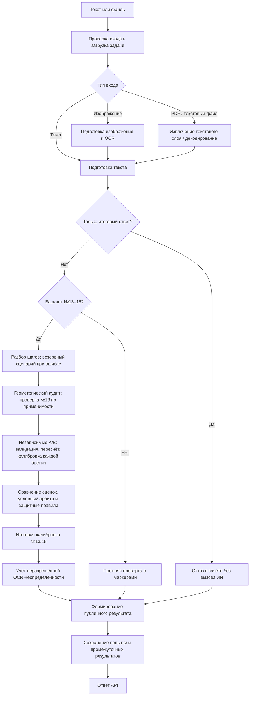

# Архитектура проверки

## Ответственность компонентов

Система разделяет распознавание записи, структурирование решения, математические проверки, выставление оценки и формирование ответа. Такое разделение помогает локализовать ошибки и менять правила одного этапа без неявного изменения остальных.

| Компонент | Ответственность | Ограничение |
|---|---|---|
| API | Проверить запрос, загрузить задачу, выбрать маршрут | Не выводить математическую оценку из технического отказа |
| OCR | Получить буквальную запись с изображения | Не исправлять решение ученика |
| Разбор шагов (`StepParser`) | Представить запись как шаги и зависимости | Не выставлять итоговый балл |
| Программные проверки | Проверить поддерживаемые факты и преобразования | Возвращать `unknown` вне области применимости |
| Оценщики A/B | Независимо оценить критерии | Не получать ответ другого оценщика |
| Арбитр | Разобрать случай по правилам вызова | Сохранять основания своего решения |
| Калибровка | Применить известное программное правило | Не менять результат без условия и происхождения |
| Формирование ответа | Согласовать оценку, статус и пояснения | Не смешивать предварительный и окончательный результат |
| Хранение | Сохранить попытку и связанные результаты | Не подтверждать сохранение до фиксации транзакции |

## Реализованный маршрут

Калибровка выполняется на двух уровнях: внутри оценщиков/арбитра до сравнения и в окончательной обработке отдельных заданий. Поэтому `llm_score`, пересчитанный `score` оценщика и публичный `score` — разные точки вычисления. Дополнительная OCR-маршрутизация текущего обработчика также может изменить публичный результат. Точная политика — в [таблицах решений](18_business_rules_and_decision_tables.md).

`StepParser` может сформировать шаги из явных фрагментов записи резервным способом. Если пригодный результат не получен, ошибка записывается и оценивание может продолжиться без структурированного контекста. Универсального символьного решателя в этом маршруте нет.

Для изображения используются несколько вариантов OCR и разрешение конфликтов; для PDF — извлечение существующего текстового слоя. Скан PDF без текста не равнозначен поддерживаемому изображению.

## Целевые гарантии

- Исходный текст хранится отдельно от технически нормализованного представления.
- Изменение математического смысла требует подтверждения; оно не относится к обычной нормализации.
- Каждый этап возвращает проверенный результат либо явную ошибку с указанием этапа.
- Совпадение оценок моделей — сигнал для маршрутизации, а не доказательство истины.
- При отсутствии оценки публикуется отсутствие результата, а не технический ноль.
- При передаче куратору сохраняется предварительный результат и задача в очереди.
- Изменения балла и маршрута имеют источник, версию правила и причину.

Состояние этих гарантий в коде отражено в [матрице реализации](20_implementation_status.md).

## Архитектурные решения

| ID | Решение | Обоснование | Компромисс |
|---|---|---|---|
| ADR-01 | Два независимых оценщика | Получить сигнал о разногласии | Дополнительные стоимость и время; ошибки могут совпадать |
| ADR-02 | Условный арбитр | Разбирать спорные случаи по явному условию | Нужна полная таблица вызовов и исключений |
| ADR-03 | Ограничить специализацию №13–15 | Проверять конкретные критерии и классы задач | Сосуществование нового и прежнего механизмов |
| ADR-04 | Программная калибровка | Обрабатывать подтверждённые классы ошибок | Нужны версии правил, отрицательные примеры и контроль переобучения |
| ADR-05 | Промежуточные данные в JSON попытки | Простое совместное сохранение | Для аналитики требуется разбор JSON |
| ADR-06 | Асинхронная внешняя интеграция | Отделить приём запроса от длительной проверки | Очередь, повторная доставка и идемпотентность |

ADR-01–ADR-05 описывают решения, отражённые в коде; ADR-06 — проектируемое расширение. Целевые контракты определены отдельно от действующих.

## Целевая интеграция

API сохраняет `CheckJob` и событие на обработку в одной транзакции, затем возвращает 202. Диспетчер доставляет событие в очередь с повторными попытками. Обработчик проверяет состояние задания и не публикует второй итоговый результат при повторной доставке. Polling доступен независимо от доставки уведомлений.

[Диаграммы взаимодействия](../diagrams/pipeline_sequence.md) показывают отдельные последовательности действующего API и целевой интеграции.
