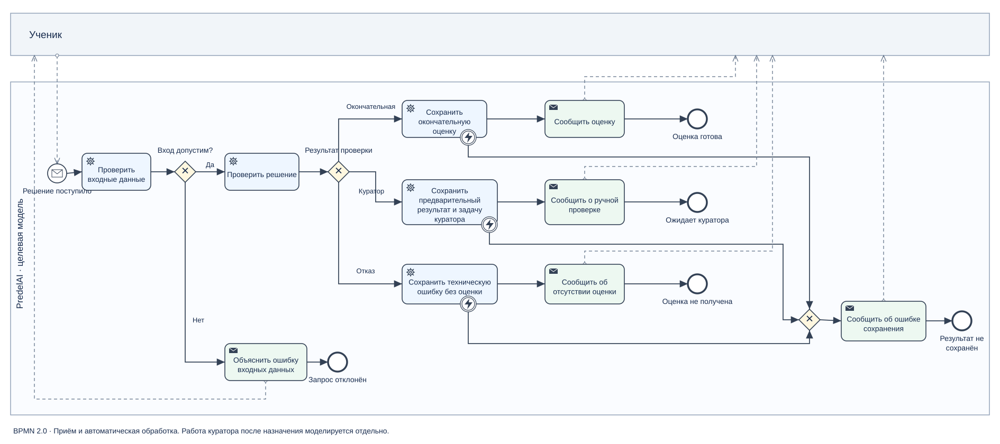

# Модели процессов

## Каталог

| Процесс | Статус | Представление |
|---|---|---|
| Отправка решения текстом на сайте | Целевой пользовательский сценарий | [UC-01: основной ход, альтернативы и ошибки](../docs/03_use_case_text_submission.md) |
| Прежняя проверка одним запросом к модели | Реализация для неспециализированных вариантов | Текстовый сценарий ниже |
| Специализированная проверка №13–15 | Реализация | [Диаграмма взаимодействия](../diagrams/pipeline_sequence.md) |
| Приём и автоматическая обработка решения | Целевая модель | [Исходник BPMN 2.0](bpmn/target_checking.bpmn), [превью SVG](exports/target_checking.svg) |
| Работа куратора после назначения | Целевая модель | [Состояния](../diagrams/state_diagram.md) и [асинхронная последовательность](../diagrams/pipeline_sequence.md) |

В репозитории находится одна отдельная BPMN-модель. Текстовые сценарии и Mermaid-диаграммы не обозначаются как дополнительные BPMN-файлы.

## Прежний процесс

1. Ученик отправляет решение.
2. API проверяет запрос и получает задачу каталога.
3. Для файлов извлекается запись; изображения проходят OCR.
4. Один запрос к модели объединяет математический анализ, критерии и комментарий.
5. Сервер разбирает текстовые маркеры, сохраняет попытку и отвечает ученику.

Слабая наблюдаемость связана с объединением математических функций в одном ответе. OCR уже является отдельным действием в файловом сценарии; утверждать, что действующий прежний маршрут всегда состоит ровно из одного внешнего вызова, нельзя.

## Граница целевой BPMN

Процесс начинается с поступления решения и заканчивается одним из четырёх исходов: окончательная автоматическая оценка, сохранённая задача куратора с предварительным результатом, ошибка входных данных или техническая невозможность оценки.

Самостоятельная работа куратора после назначения находится за границей этой BPMN. Она показана в модели состояний и диаграмме взаимодействия. Задача «Проверить решение» свёрнута: внутренние A/B, арбитр и программные правила раскрыты отдельными техническими диаграммами.

Внешний участник — ученик. Последовательные потоки находятся внутри процесса PredelAI, обмен с учеником показан потоками сообщений. Исключающие шлюзы выбирают один исход. Перед сообщением об оценке или передаче куратору соответствующие данные должны быть сохранены. Техническая неудача сообщает об отсутствии оценки и не выставляет ноль.

## Связь с требованиями

Приём — FR-002/FR-003; проверка — FR-005–FR-012; ответ и сохранение — FR-013–FR-015; создание задачи куратора — FR-P-003. Условия завершения — PAC-09, PAC-10, PAC-12 и PAC-P-01.
