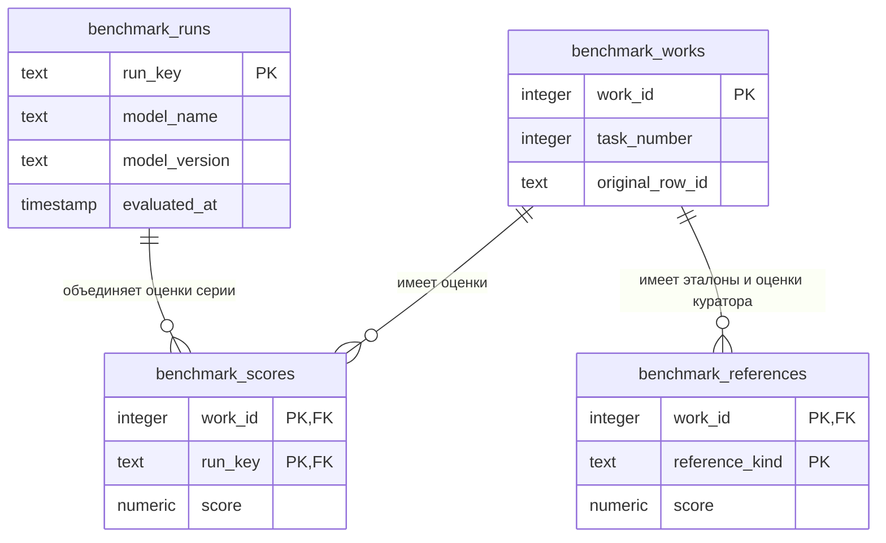

# Сравнение двух продуктов: модель данных и JOIN

Отдельный аналитический блок PostgreSQL для [выборки на 165 работ](../../docs/21_product_comparison.md). Эталон — `true_score`, выставленный командой проекта для разработки, по подтверждению автора кейса от 16 сентября 2026 года. Оценка куратора хранится отдельно: она могла быть неверной. Первую таблицу на 9 042 работы этот блок не изменяет и не объединяет со второй.

## Модель и ключи

[00_schema.sql](00_schema.sql) создаёт четыре временные таблицы в одной сессии. Они не являются таблицами приложения или миграцией его БД.



| Сущность | Единица записи и ограничение |
|---|---|
| Работа | Одна строка исходного снимка. `work_id` — новый номер, уникальный внутри снимка. При объединении снимков нужен также `snapshot_id` |
| Серия оценок | Один столбец оценок одного продукта: `predel` или `their`. Реальные версии и даты запусков неизвестны, поля оставлены `NULL` |
| Оценка системы | Не более одной числовой оценки на пару `(work_id, run_key)`; внешний ключ связывает её с работой и серией |
| Ручная оценка | Не более одной оценки каждого вида на работу: `team` из `true_score`, `curator` из `curator_score`. Для метрик выбирается только `team` |

`original_row_id` повторяется в 18 группах и не является ключом. `task_id` источника — номер задания ЕГЭ, а не ID конкретной задачи. Поэтому в аналитической модели он называется `task_number`. Отдельная сущность конкретной задачи потребовала бы надёжного сопоставления условия с каталогом; такого ключа в анализе не предполагается. Строки не объединяются только по номеру задания или одинаковому условию.

Серии отражают столбцы полученного снимка, а не доказанно единичные запуски одной версии программы. Для будущего сравнения запусков нужно заполнить версии и даты, завести отдельные `run_key` и явно выбрать две серии. Повторный результат не должен молча перезаписывать прежний.

## Подготовка

Заголовки сопоставляются по именам. `PredelAI_score` и `their_ai_score` преобразуются в числовые оценки соответствующей серии. Пустые значения и `-` обозначают отсутствие записи оценки; **ноль сохраняется как оценка**. Некорректные или отрицательные числа останавливают импорт. Проверка верхней границы балла не выполняется: столбца максимума и версии критериев в источнике нет.

Выгрузка содержит 27 колонок, из которых 13 имеют имена; пустые служебные колонки не используются. Производные `Correct`, `Diff` и `predelAccuracity` не импортируются: метрики пересчитываются. Фото, тексты решений и комментарии не нужны для этих агрегатов и не попадают в подготовленный JSON или проект. Поле `reason_of_lowering` не объявляется комментарием сторонней модели — его авторство отдельно не установлено.

## Запросы

| Файл | Цель | Что показывает |
|---|---|---|
| [01 — полнота](01_coverage.sql) | Определить доступные знаменатели | Все работы, наличие эталона и оценок каждого продукта, размер общей выборки по заданию |
| [02 — парная точность](02_paired_accuracy.sql) | Сравнить системы на одних работах | Совпадения, процент и MAE по заданию и в целом; итоговая строка имеет `task_number = NULL` |
| [03 — исходы сравнения](03_outcomes.sql) | Оценить относительную величину ошибок | Обе системы точны, одна ближе к эталону либо одинаковая ошибка по модулю |
| [04 — проверка эталона](04_reference_audit.sql) | Отделить оценку куратора от эталона команды | Число заполненных пар ручных оценок и число различий между ними |

Два основных JOIN решают разные задачи. В 01 условия вида оценки находятся в `ON`: `LEFT JOIN` сохраняет даже работы без оценок. Перенос этих условий в `WHERE` потерял бы строки с пропусками. В 02 `INNER JOIN` осознанно формирует общую выборку. Составные первичные ключи обеспечивают не более одного совпадения с каждым присоединённым видом оценки, поэтому число работ не увеличивается из-за соединения.

При пустой общей выборке 02 и 03 возвращают пустой результат, а не 0% точности. Отсутствие балла не доказывает отказ модели; нельзя сравнивать 116 доступных оценок PredelAI со 121 оценкой другой системы как одинаковые выборки. Совпадение балла не подтверждает корректность комментариев.

## Воспроизведение

Из корня кейса, с CSV фиксированного снимка:

```sh
python tools/prepare_comparison_dataset.py /путь/к/выгрузке.csv --output-dir /tmp/predel-comparison-analysis
node tools/analyze_comparison_dataset.mjs /tmp/predel-sql-validation /tmp/predel-comparison-analysis/prepared-comparison.json
```

Зависимость PGlite и окружение описаны в [инструкции инструментов](../../tools/README.md). Подготовленные строки сохраняются вне проекта. Скрипт анализа проверяет семь синтетических сценариев, выполняет четыре запроса и независимо пересчитывает метрики. В [протокол](../../verification/comparison-analysis-report.json) попадают агрегаты и контрольные суммы.

Для ручного выполнения можно создать таблицы из 00 в отдельном подключении PostgreSQL, загрузить подготовленные данные с указанным сопоставлением, затем выполнить 01–04 в той же сессии. Закрытие сессии удаляет временные таблицы.
